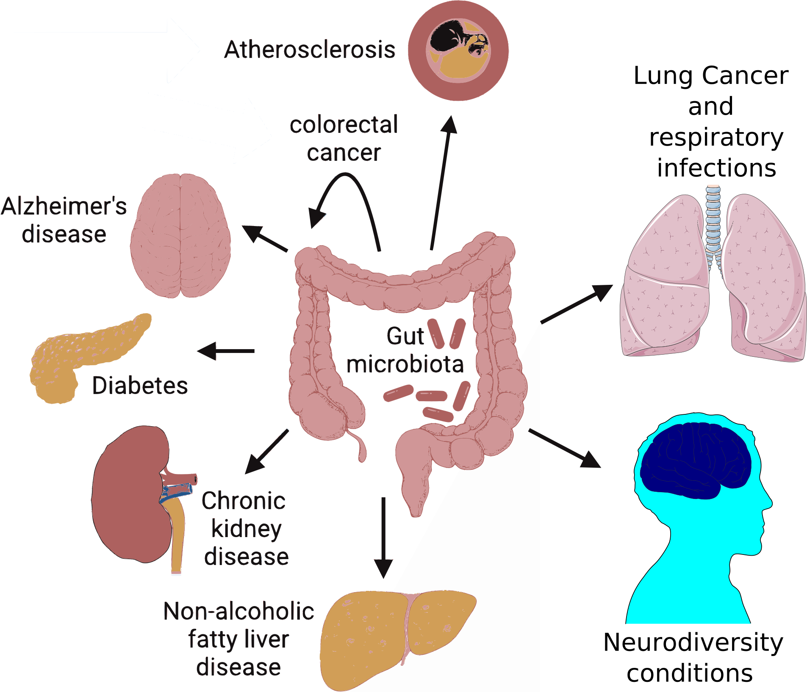
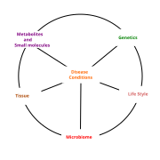
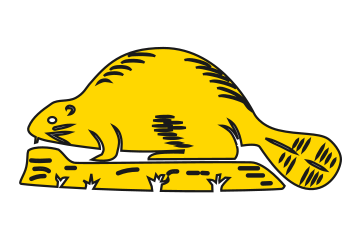
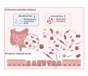
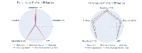
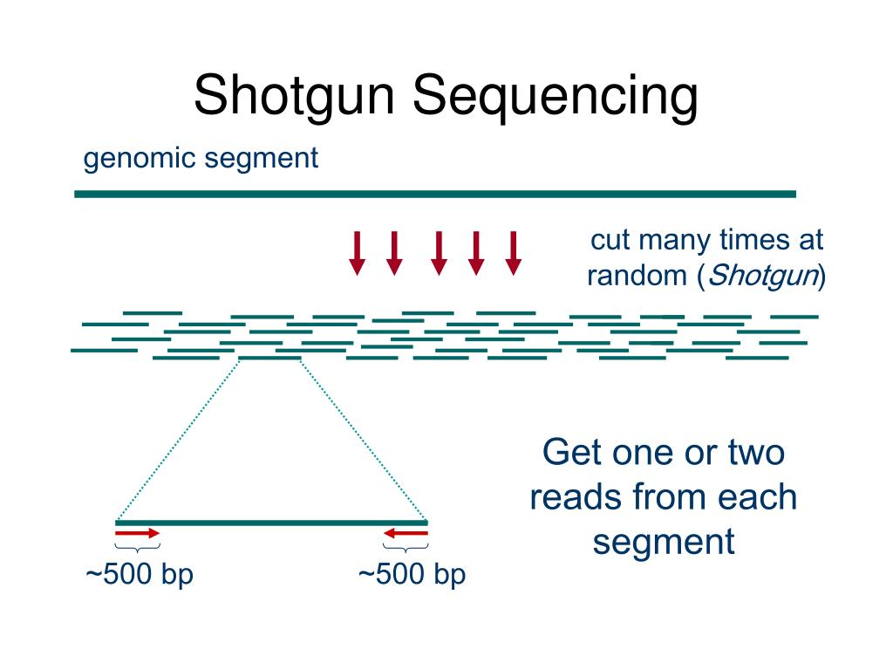
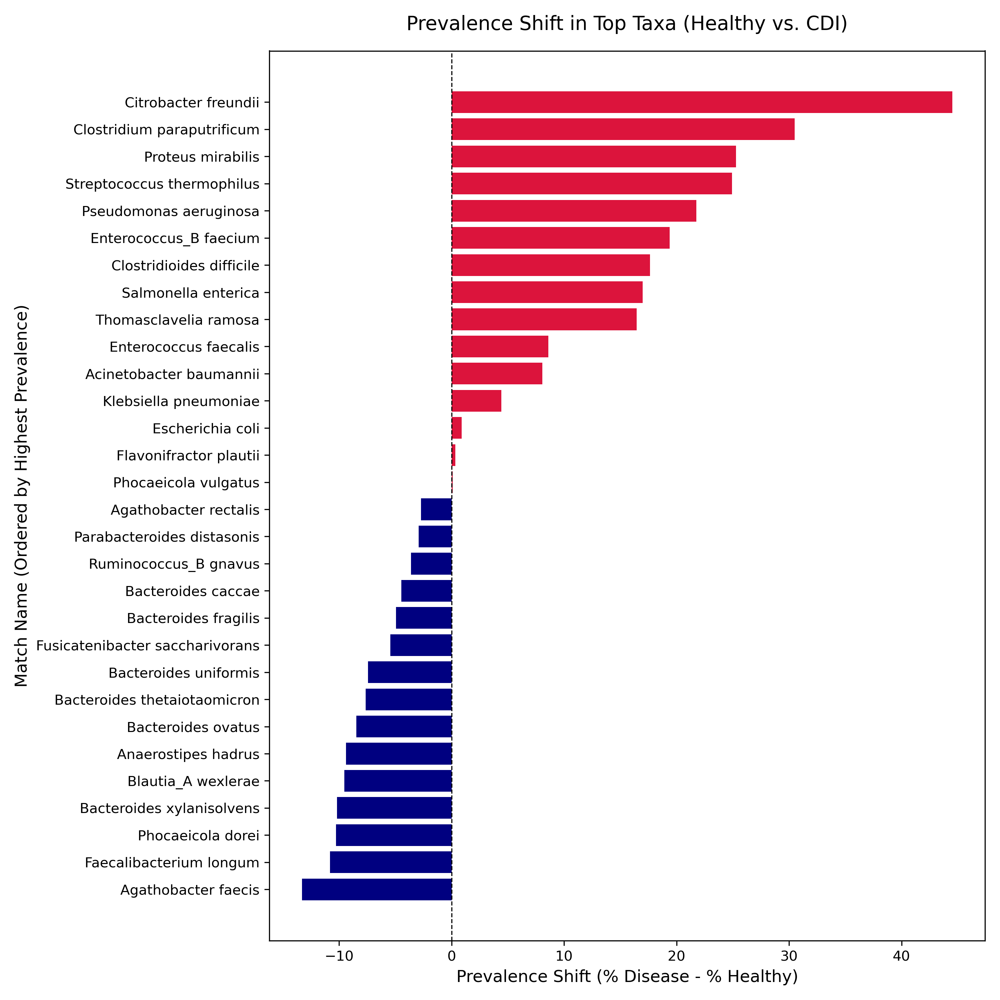

# Overview 

:::{.notes}

https://jamesgoldie.dev/writing/stack-gradients-in-r/
https://www.whocanuse.com

:::

:::{.nonincremental}

- Storytelling
- Microbial ecology
- Reference databases
- Environmental DNA
- Sequence saturation
- Tangential thoughts

:::

## [Gut microbial ecology is linked with disease]{.small}

### Exposition

:::{.notes}

what is the human gut environment

Show examples of the different body sites connected to gut

:::

:::{style="text-align: center;"}
{width="50%" fig-align='center'}
:::

## Conditions are dependent on many factors

### Exposition

:::{.notes}
over the last 20 years, we have speculated in the literature about a core set of microbes that live in the human gut maintaining a balanced ecosystem to exchange the indigestible nutrients like fiber for vitamins, SCFA, and other metabolites.

define homeostasis and dysbiosis

drive the point that community profile is unknown

:::

:::{.columns}

::::{.column}



::::

::::{.column .fragment}

{width="50%" fig-align="center"}

:::::{.fragment}

{width="50%" fig-align="center"}

:::::

::::

:::

## Keystone microbiota define homeostasis

### Inciting incident

:::{style="text-align: center;"}
{width="50%" fig-align='center'}
:::

##

<style>
/* The animated oval and line */
.bio-overlay {
  display: inline-block;
  border: 2px solid red;
  border-radius: 50px;
  padding: 0.2em 0.5em;  /*Starting padding */
  transition: all 1.8s ease-in-out;
  background: linear-gradient(transparent 48%, red 48%, red 52%, transparent 52%) no-repeat;
  background-size: 0% 100%; /* Line starts hidden */
}

/* When the fragment triggers, the overlay shrinks and the line draws */
.fragment.visible .bio-overlay {
  padding: 0.1em 0.3em;
  background-size: 100% 100%;
}
</style>

::: {.center-xy}
::: {.r-stack}

:::{.fragment .fade-in-then-out}
[Hypothesis-driven]{style="font-size: 2em; opacity: 1;"}
:::

::: {.fragment .fade-in-then-out}
[[Hypothesis-driven]{.bio-overlay}]{style="font-size: 2em; background: white;"}
:::

::: {.fragment}
[Exploratory + Instinct!]{style="font-size: 2em; opacity: 1;"}
:::

:::
:::


## [Pangenomes are the combined information of genomes by taxonomic bins]{.smallest}

### Rising action

```{=html}
<iframe width="1000" height="500" src="fig/sankey_diagram.html" title="Quarto Documentation"></iframe>
```

## [Biologically informed database design smooths out noise]{.smallest}

### Rising action

```{r}
library(ggplot2)
library(patchwork)
library(purrr)

# 1. Reconstruct dataset from the raw scores table (N = 20)
df <- data.frame(
  score = c(
    22, 25,                 # 20-30 bin (n = 2)
    36, 38, 36, 38,         # 30-40 bin (n = 4)
46, 45, 48, 46,         # 40-50 bin (n = 4)
    55, 55, 52, 58, 55,     # 50-60 bin (n = 5)
    68, 67, 61,             # 60-70 bin (n = 3)
    72,                     # 70-80 bin (n = 1)
    91                      # 90-100 bin (n = 1)
  )
)

# 2. Function to build histogram for specified binwidth
create_bin_plot <- function(bw) {
  fill_col <- if (bw == 1) "#d95f02" else if (bw == 10) "#2b5c8f" else "#7570b3"
  
  ggplot(df, aes(x = score)) +
    geom_histogram(
      binwidth = bw, 
      fill = fill_col, 
      color = "white", 
      boundary = 20, 
      alpha = 0.85
    ) +
    labs(
      title = paste0("Binwidth = ", bw),
      subtitle = if (bw == 1) "Gappy & overly sensitive" 
            else if (bw == 10) "Original table-level grouping" 
            else NULL,
      x = "Score", 
      y = "Count"
    ) +
    scale_x_continuous(limits = c(20, 100), breaks = seq(20, 100, by = 20)) +
    theme_minimal(base_size = 11) +
    theme(
      plot.title = element_text(face = "bold", size = 11),
      plot.subtitle = element_text(size = 8.5, color = if (bw == 1) "#d95f02" else "grey40"),
      panel.grid.minor = element_blank()
    )
}

# 3. Create plots for binwidths 1 through 5, plus 10 (table's original bin size)
binwidths <- c(1, 10, 20)
plots <- map(binwidths, create_bin_plot)

# 4. Assemble into a 2x3 grid layout
wrap_plots(plots, ncol = 3) +
  plot_annotation(
    subtitle = "At binwidth = 1, sparse sample data creates false gaps. Broader bins smooth out the noise to reveal the underlying shape.",
    caption = "Data: 20 individual scores extracted from table (Range: 20–100)"
  )
```

## [Benchmarking shows an improvement in precision]{.small}

### Rising action



## [Shotgun sequencing is big, messy data of an entire environment]{.smallest}

### Rising action

{width=50%}

## Microbiome sampling has pros and cons 

### Rising action

```{r}
library(tidyverse)
library(plotly)
library(reactable)
library(htmltools)

# 1. Build the Structured Dataset
microbiome_tradeoffs <- tibble::tribble(
  ~Topic, ~Category, ~Point, ~Detail,
  
  "Isolation & Cultivation", "Pro", "Phenotypic Validation", 
  "Enables direct functional, physiological, and mechanistic testing of live strains in gnotobiotic models.",
  
  "Isolation & Cultivation", "Con", "Great Plate Count Anomaly", 
  "Over 95–99% of gut species remain unculturable in standard lab conditions; strong bias toward fast-growing taxa.",
  
  "Amplicon Profiling (16S/ITS)", "Pro", "Cost & Host Resilience", 
  "Highly cost-effective for large cohorts; target primers bypass host DNA background in tissue/swab samples.",
  
  "Amplicon Profiling (16S/ITS)", "Con", "Resolution & PCR Bias", 
  "Limited to genus-level resolution; blind to functional genes; prone to PCR amplification & gene copy number distortions.",
  
  "Shotgun Metagenomics", "Pro", "Strain & Gene Depth", 
  "Provides species/strain resolution, metabolic pathway profiling, and multi-kingdom coverage (bacteria, viruses, fungi).",
  
  "Shotgun Metagenomics", "Con", "Scale & Complexity", 
  "Produces massive data volumes requiring high-performance compute/storage; heavily dominated by host DNA in low-biomass samples.",
  
  "Sample Metadata", "Pro", "Analytical Context", 
  "Essential for controlling key confounders (diet, medications, host genetics) and enabling cross-study machine learning.",
  
  "Sample Metadata", "Con", "Human Error & Disparity", 
  "Wildly dependent on manual data entry; missing, non-standardized, or inaccurate metadata destroys public dataset utility."
)

html_card_matrix <- reactable(
  microbiome_tradeoffs,
  groupBy = "Topic",
  searchable = TRUE,
  defaultExpanded = TRUE,
  columns = list(
    Topic = colDef(name = "Microbiome Workflow Area", minWidth = 200),
    Category = colDef(
      name = "Type", 
      width = 90,
      cell = function(value) {
        color <- if (value == "Pro") "#2E7D32" else "#C62828"
        bg <- if (value == "Pro") "#E8F5E9" else "#FFEBEE"
        span(
          style = list(
            color = color, 
            backgroundColor = bg,
            padding = "4px 8px", 
            borderRadius = "4px", 
            fontWeight = "bold",
            fontSize = "12px"
          ),
          value
        )
      }
    ),
    Point = colDef(name = "Core Theme", minWidth = 180, style = list(fontWeight = "bold")),
    Detail = colDef(name = "Description & Impact", minWidth = 350)
  ),
  bordered = TRUE,
  highlight = TRUE,
  theme = reactableTheme(
    headerStyle = list(backgroundColor = "#F7F9FA", textTransform = "uppercase", fontSize = "12px")
  )
)

# Render HTML Dashboard Widget
html_card_matrix
```

## [Correcting metadata by filtering for depth & breadth]{.small}
### Rising action

Depth: Are we seeing the sequence information more than once?

$$
Saturation = 1 - \frac{breadth}{depth} \geq 25\%
$$

<br>

Breadth: Are we seeing enough sequence information?

$$
Total\ breadth = \sum_{\text{sequence info}\ \in\ \text{Sequence}} \text{sequence info} \geq 1\ \text{MBp}
$$

## [Bio-binning and correcting metadata found core microbiome species]{.smallest}

### Climax

:::: {.columns}

::: {.column width="50%"}

:::: {.callout-tip}
### 8% of our 36,000 human stool samples 
::::

- Anaerobic to aerobic
- Obligate to facultative
:::

::: {.column width="50%"}

:::

::::

## [Functional profiles show what communties can do differently!]{.smallest}
### Falling action

:::{.r-stack}

:::{.disappear-on-fragment}

Intersect the found pangenome species with the all samples of specific metadata

```{r}
#| echo: false

library(ggVennDiagram)
library(ggplot2)

genes <- paste("gene",1:1000,sep="")
set.seed(20231214)
x <- list(Pangenome=sample(genes,300),
          'Condition Data'=sample(genes,525))

venn <- Venn(x)
data <- process_data(venn)

ggplot() +
  geom_polygon(aes(X, Y, fill = id, group = id), 
               data = venn_regionedge(data),
               show.legend = FALSE) +
  geom_path(aes(X, Y, color = id, group = id), 
            data = venn_setedge(data), 
            linewidth = 3,
            show.legend = FALSE) +
  geom_text(aes(X, Y, label = name), 
            fontface = "bold",
            data = venn_setlabel(data)) +
  geom_label(aes(X, Y, label = id), 
             data = venn_regionlabel(data),
             alpha = 0.25) +
  coord_flip() +
  theme_void()
```
:::

:::{.fragment .disappear-fragment}

Isolate and extract only the intersecting signal

```{r}
#| echo: false
region_edges <- venn_regionedge(data)
intersect_edges <- subset(region_edges, grepl("/", id))

ggplot() +
  geom_polygon(
    aes(X, Y, group = id),
    data = region_edges,
    fill = NA,
    color = "black"  # keeps edges black
  ) +
  geom_polygon(
    aes(X, Y, group = id),
    data = intersect_edges,
    fill = "#33CC33",  # your green
    alpha = 0.9,
    color = "black"     # edge same as the other regions
  ) +
  geom_path(
    aes(X, Y, color = id, group = id),
    data = venn_setedge(data),
    linewidth = 3,
    show.legend = FALSE
  ) +
  geom_text(
    aes(X, Y, label = name),
    data = venn_setlabel(data),
    fontface = "bold"
  ) +
  geom_label(
    aes(X, Y, label = id),
    data = venn_regionlabel(data),
    alpha = 0.25
  ) +
  
  coord_flip() +
  theme_void()
```
:::

:::{.fragment .disappear-fragment}

This is the pangenomic profile of the sample conditions

```{r}
#| echo: false

ggplot() +
  geom_polygon(
    aes(X, Y, group = id),
    data = region_edges,
    fill = NA,
    color = "grey"
  ) +
  geom_polygon(
    aes(X, Y, group = id),
    data = intersect_edges,
    fill = "#33CC33",  # intersect green
    alpha = 0.9,
    color = "black"
  ) +
  geom_path(
    aes(X, Y, group = id),
    data = venn_setedge(data),
    color = "grey",
    linewidth = 3,
    show.legend = FALSE
  ) +
  geom_text(
    aes(x = X-5, y = Y, label = name),
    data = subset(data$regionLabel, id == "1/2"),  # Only intersection
    fontface = "bold"
  ) +
  geom_label(
    aes(X, Y, label = id),
    data = subset(data$regionLabel, id == "1/2"),  # Only intersection
    alpha = 0.25
  ) +
  coord_flip() +
  theme_void()
```
:::

:::

## Acknowledgments

### Resolution

:::{.nonincremental}
- C. Titus Brown
- Annie
- Bry
- Gina
- Tina
- Tamer
- Mo
- Enoch Baldwin
- Carole Hom
:::
